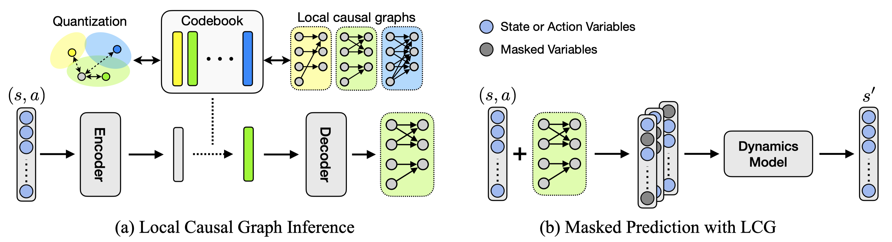

# Fine-Grained Causal Dynamics Learning



This repository includes the official code of our paper:
> [**Fine-Grained Causal Dynamics Learning with Quantization for Improving Robustness in Reinforcement Learning**](https://openreview.net/forum?id=mrd4e8ZJjm) <br>
> Inwoo Hwang, Yunhyeok Kwak, Suhyung Choi, Byoung-Tak Zhang, Sanghack Lee <br>
> *International Conference on Machine Learning (ICML), 2024*


This repository also contains the pytorch implementation of NCD:
> [**On Discovery of Local Independence over Continuous Variables via Neural Contextual Decomposition**](https://openreview.net/forum?id=-aFd28Uy9td) <br>
> Inwoo Hwang, Yunhyeok Kwak, Yeon-Ji Song, Byoung-Tak Zhang, Sanghack Lee <br>
> *Conference on Causal Learning and Reasoning (CLeaR), 2023*


## Overview

### Install
```
# Install dependencies:
conda env create -f environment.yml
```

### Run experiments
Change "wandb_dir" in policy_params.json
```
# Run FCDL (Ours)
bash scripts/run_ours.sh

# Run MLP
bash scripts/run_mlp.sh

# Run GNN
bash scripts/run_gnn.sh

# Run NCD
bash scripts/run_ncd.sh

# Run Oracle
bash scripts/run_oracle.sh
```

### Arguments
* `local_causal_rule`: environments; choices: ['full_fork', 'full_chain']
* `test_params`: downstream tasks where n is the number of noisy nodes in Chemical:
  * `test1`: n=2
  * `test2`: n=4
  * `test3`: n=6
* `codebook_size, code_dim`: quantization degree (K) and dimension for each latent code; default is (16, 16) but other choices also work well; (4, 8), (8, 16), (32, 16), etc
* `vqvae_ema`: using EMA to update the codebook; default is True
* `code_labeling`: default is False for FCDL and True for NCD but any choices work well for both methods
* `reg_coef`: $\lambda$ in Eq. (6); default is 0.001
* `commit_coef`: $\beta$ in Eq. (6); default is 0.25

## Acknowledgements
Our implementation is based on [CDL](https://github.com/wangzizhao/CausalDynamicsLearning). Thanks for the implementation!

## Citation
If you find our work useful for your research, please consider citing our papers.
```bib
@inproceedings{hwang2024finegrained,
  title={Fine-Grained Causal Dynamics Learning with Quantization for Improving Robustness in Reinforcement Learning},
  author={Hwang, Inwoo and Kwak, Yunhyeok and Choi, Suhyung and Zhang, Byoung-Tak and Lee, Sanghack},
  booktitle={Proceedings of the 41th International Conference on Machine Learning},
  year={2024}
}
```

```bib
@inproceedings{hwang2023discovery,
  title={On discovery of local independence over continuous variables via neural contextual decomposition},
  author={Hwang, Inwoo and Kwak, Yunhyeok and Song, Yeon-Ji and Zhang, Byoung-Tak and Lee, Sanghack},
  booktitle={Conference on Causal Learning and Reasoning},
  pages={448--472},
  year={2023},
  organization={PMLR}
}
```
